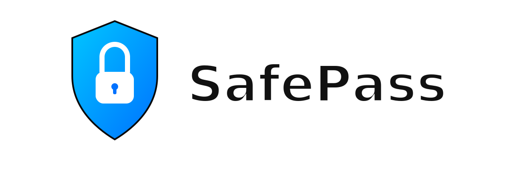

  
  

  Safe passwords, always.

  
  
  

  
  

---

## About

**SafePass** is a password manager designed to easily create strong and secure passwords. It features a strength validator that shows how strong your password is and makes it easy to store and manage them. The live version runs in the browser using `localStorage` and does not use a database.

## Features

- Password storage
- Strong password generator
- Password strength validator
- User authentication
- Dark mode
- Responsive (mobile + desktop)

---

## License

This project is licensed under the [MIT License](LICENSE).

## Contributing

Contributions are welcome! Feel free to fork the repository and submit a pull request. Please ensure your code follows the existing style and structure.
